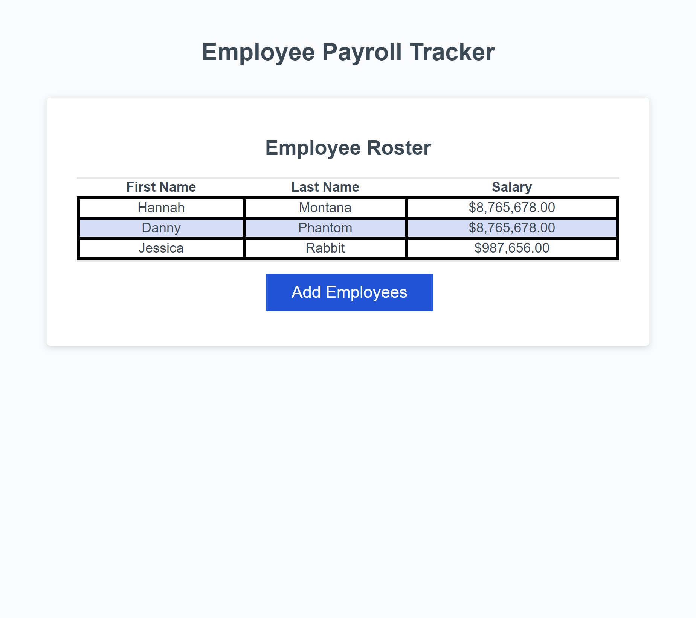

# challenge-3-payroll

## Description

This project is an enhancement of an existing payroll tracking program. Initially it displayed the framework of a table of employees and indicated the desire for additional functions. I added funtionality to the employee tracker, average salary calculator, and random employee generator. 

## Usage

This page can be used by an employer to list the names and salaries of their employees. Using the console, they can see the average salary of their employees, as well as choose a random employee. This could be useful for business planning purposes such as determining starting salaries or choosing a person for a random drug screening. 

https://melivesel.github.io/challenge-3-payroll/

## Credits

https://developer.mozilla.org/en-US/docs/Web/JavaScript/Reference/Template_literals
UT Bootcamp Xpert Learning Assistant and UT Bootcamp Learning Materials, specifically the rock paper scissors game. 

## License

Please refer to the license referenced in the repo